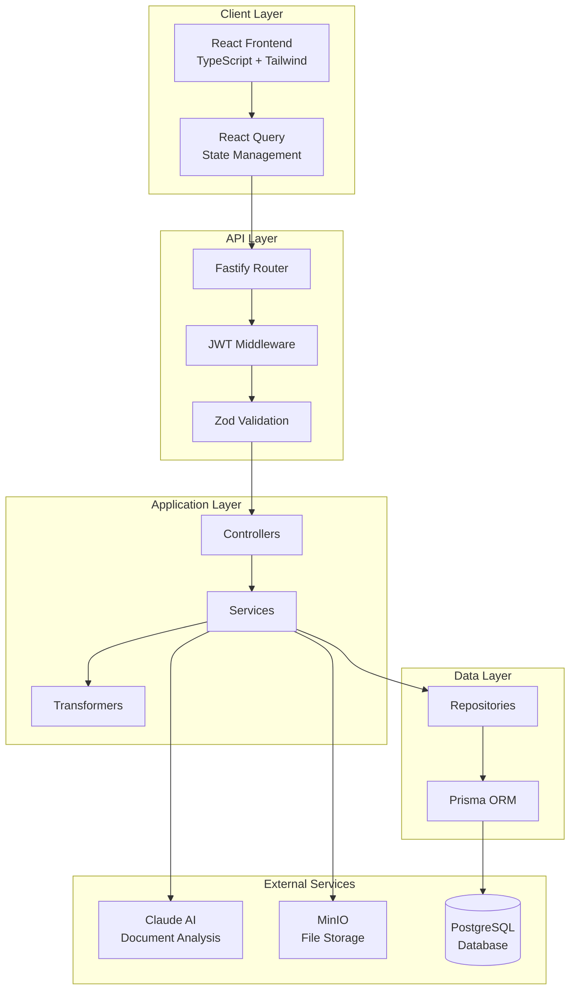
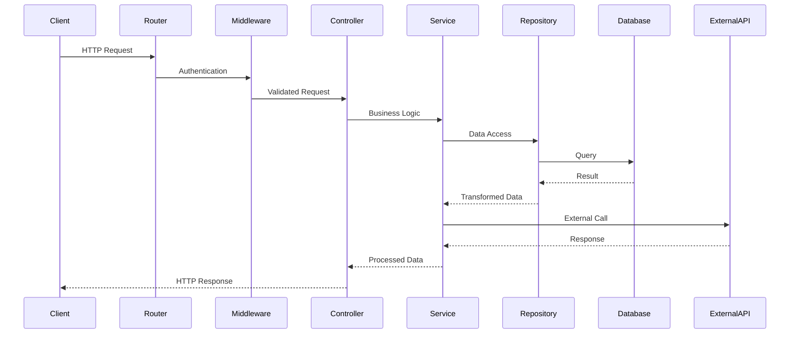

# Architecture Technique - APOCALIPSSI

## Vue d'ensemble

APOCALIPSSI suit une architecture moderne en 3 tiers avec séparation claire des responsabilités :

- **Frontend** : Application React SPA avec gestion d'état réactive
- **Backend** : API REST Fastify avec architecture en couches
- **Services** : Intégrations tierces (Claude AI, MinIO, PostgreSQL)

## Schéma d'Architecture Globale



## Frontend Architecture

### Structure des Dossiers

```
src/
├── api/           # Services API et requêtes
├── components/    # Composants réutilisables
│   ├── ui/        # Composants UI basiques
│   └── layout/    # Composants de mise en page
├── features/      # Features métier organisées par domaine
│   ├── auth/      # Authentification
│   ├── document/  # Gestion des documents
│   └── user/      # Gestion des utilisateurs
├── stores/        # Stores globaux (Zustand)
├── routes/        # Configuration des routes
├── types/         # Types TypeScript
└── lib/           # Utilitaires et configurations
```

### Patterns Utilisés

#### 1. Feature-Based Architecture
Chaque feature contient ses propres composants, hooks et types.

#### 2. React Query Pattern
```typescript
// Exemple dans documentQueries.ts
export const useGetAllDocuments = () => {
  return useQuery({
    queryKey: ['documents'],
    queryFn: documentService.getAllDocuments,
    staleTime: 5 * 60 * 1000, // 5 minutes
  });
};
```

#### 3. Custom Hooks Pattern
```typescript
// Hook personnalisé pour upload
export const useUploadDocument = () => {
  const queryClient = useQueryClient();
  
  return useMutation({
    mutationFn: documentService.uploadDocument,
    onSuccess: () => {
      queryClient.invalidateQueries(['documents']);
    },
  });
};
```

## Backend Architecture

### Structure en Couches

```
src/
├── routes/        # Définition des routes HTTP
├── controllers/   # Logique de contrôle des requêtes
├── services/      # Logique métier
├── repositories/  # Accès aux données
├── transformers/  # Transformation des données
├── middleware/    # Middlewares transversaux
├── types/         # Types et interfaces
└── utils/         # Utilitaires
```

### Flux de Traitement



### Patterns d'Architecture

#### 1. Repository Pattern
```typescript
export class DocumentRepository {
  async create(data: CreateDocumentData): Promise<Document> {
    return prisma.document.create({ data });
  }
  
  async findById(id: string): Promise<Document | null> {
    return prisma.document.findUnique({ where: { id } });
  }
}
```

#### 2. Service Layer Pattern
```typescript
export class DocumentService {
  constructor(
    private documentRepository: DocumentRepository,
    private claudeAiService: ClaudeAiService,
    private minioService: MinioService
  ) {}
  
  async uploadAndAnalyze(file: Buffer, userId: string) {
    // 1. Store file
    const fileUrl = await this.minioService.uploadFile(file);
    
    // 2. Analyze with AI
    const analysis = await this.claudeAiService.analyzeDocument(file);
    
    // 3. Save to database
    return this.documentRepository.create({
      userId,
      fileUrl,
      ...analysis
    });
  }
}
```

#### 3. DTO & Transformer Pattern
```typescript
// DTO pour validation
export const CreateDocumentSchema = z.object({
  title: z.string(),
  content: z.string(),
});

// Transformer pour formatage
export const documentTransformer = {
  toApi: (document: Document): DocumentApiResponse => ({
    id: document.id,
    title: document.title,
    createdAt: document.createdAt.toISOString(),
    // ... autres transformations
  })
};
```

## Base de Données

### Schéma Prisma

```prisma
model User {
  id        String     @id @default(cuid())
  email     String     @unique
  documents Document[]
  createdAt DateTime   @default(now())
  updatedAt DateTime   @updatedAt
}

model Document {
  id          String            @id @default(cuid())
  title       String
  content     String?
  fileUrl     String?
  summary     String?
  keyPoints   KeyPoint[]
  suggestions ActionSuggestion[]
  userId      String
  user        User              @relation(fields: [userId], references: [id])
  createdAt   DateTime          @default(now())
  updatedAt   DateTime          @updatedAt
}
```

### Relations et Index

- **Relations** : One-to-Many entre User et Document
- **Index** : Sur userId, createdAt pour optimiser les requêtes
- **Contraintes** : Email unique, références étrangères

## Intégrations Externes

### Claude AI Service

```typescript
export class ClaudeAiService {
  async analyzeDocument(content: string): Promise<DocumentAnalysis> {
    const response = await this.client.messages.create({
      model: "claude-3-sonnet-20240229",
      messages: [{
        role: "user",
        content: this.buildPrompt(content)
      }],
      max_tokens: 4000
    });
    
    return this.parseResponse(response.content);
  }
}
```

### MinIO Storage

```typescript
export class MinioService {
  async uploadFile(file: Buffer, filename: string): Promise<string> {
    const objectName = `${Date.now()}-${filename}`;
    
    await this.client.putObject(
      this.bucketName,
      objectName,
      file
    );
    
    return this.getFileUrl(objectName);
  }
}
```

## Sécurité

### Authentification JWT

```typescript
// Middleware d'authentification
export const authMiddleware = async (request: FastifyRequest) => {
  const token = request.headers.authorization?.replace('Bearer ', '');
  
  if (!token) {
    throw new AppError('Token manquant', 401);
  }
  
  const decoded = jwt.verify(token, process.env.JWT_SECRET);
  request.user = decoded;
};
```

### Validation des Données

```typescript
// Validation Zod automatique
const createDocumentSchema = z.object({
  title: z.string().min(1).max(255),
  file: z.object({
    mimetype: z.literal('application/pdf'),
    size: z.number().max(10 * 1024 * 1024) // 10MB max
  })
});
```

## Performance et Optimisation

### Frontend
- **Code Splitting** : Lazy loading des routes
- **Memoization** : React.memo, useMemo, useCallback
- **Caching** : React Query avec staleTime optimisé
- **Bundle Optimization** : Tree shaking, compression

### Backend
- **Connection Pooling** : Prisma avec pool de connexions
- **Caching** : Redis pour mise en cache des données fréquentes
- **Rate Limiting** : Protection contre les abus
- **Pagination** : Limitation des résultats avec curseur

### Base de Données
- **Indexation** : Index sur les colonnes fréquemment requêtées
- **Requêtes Optimisées** : Jointures efficaces, select spécifiques
- **Migrations** : Versioning des schémas

## Monitoring et Logging

### Logging Structuré

```typescript
// Winston logger configuration
export const logger = winston.createLogger({
  level: process.env.LOG_LEVEL || 'info',
  format: winston.format.combine(
    winston.format.timestamp(),
    winston.format.errors({ stack: true }),
    winston.format.json()
  ),
  transports: [
    new winston.transports.File({ filename: 'logs/error.log', level: 'error' }),
    new winston.transports.File({ filename: 'logs/combined.log' })
  ]
});
```

### Métriques
- **Temps de réponse** : Mesure des performances API
- **Erreurs** : Tracking des erreurs par endpoint
- **Usage** : Statistiques d'utilisation des features

## Déploiement

### Docker Configuration

```dockerfile
# Backend Dockerfile
FROM node:18-alpine
WORKDIR /app
COPY package*.json ./
RUN npm ci --only=production
COPY . .
RUN npm run build
EXPOSE 3001
CMD ["npm", "start"]
```

### Environment Configuration

- **Development** : Variables locales, hot reload
- **Staging** : Configuration de test, données mockées
- **Production** : Variables sécurisées, optimisations activées

## Évolutivité

### Scalabilité Horizontale
- **Backend** : Stateless, prêt pour load balancing
- **Database** : Read replicas pour la lecture
- **Storage** : MinIO distribué

### Nouvelles Features
- **Plugin System** : Architecture modulaire pour extensions
- **API Versioning** : Support de multiples versions API
- **Microservices** : Prêt pour découpage en services

---

Cette architecture garantit une base solide, maintenable et évolutive pour APOCALIPSSI. 